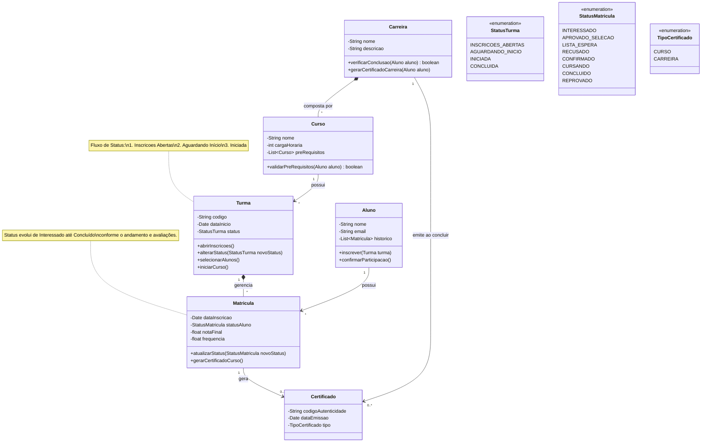

```mermaid
classDiagram

class Carreira {
    -String nome
    -String descricao
    +verificarConclusao(Aluno aluno) boolean
    +gerarCertificadoCarreira(Aluno aluno)
}

class Curso {
    -String nome
    -int cargaHoraria
    -List~Curso~ preRequisitos
    +validarPreRequisitos(Aluno aluno) boolean
}

class Turma {
    -String codigo
    -Date dataInicio
    -StatusTurma status
    +abrirInscricoes()
    +alterarStatus(StatusTurma novoStatus)
    +selecionarAlunos()
    +iniciarCurso()
}

class StatusTurma {
    <<enumeration>>
    INSCRICOES_ABERTAS
    AGUARDANDO_INICIO
    INICIADA
    CONCLUIDA
}

class Aluno {
    -String nome
    -String email
    -List~Matricula~ historico
    +inscrever(Turma turma)
    +confirmarParticipacao()
}

class Matricula {
    -Date dataInscricao
    -StatusMatricula statusAluno
    -float notaFinal
    -float frequencia
    +atualizarStatus(StatusMatricula novoStatus)
    +gerarCertificadoCurso()
}

class StatusMatricula {
    <<enumeration>>
    INTERESSADO
    APROVADO_SELECAO
    LISTA_ESPERA
    RECUSADO
    CONFIRMADO
    CURSANDO
    CONCLUIDO
    REPROVADO
}

class Certificado {
    -String codigoAutenticidade
    -Date dataEmissao
    -TipoCertificado tipo
}

class TipoCertificado {
    <<enumeration>>
    CURSO
    CARREIRA
}

%% Relacionamentos
Carreira "1" *-- "*" Curso : composta por
Curso "1" --> "*" Turma : possui
Turma "1" *-- "*" Matricula : gerencia
Aluno "1" --> "*" Matricula : possui
Matricula "1" --> "0..1" Certificado : gera
Carreira "1" --> "0..*" Certificado : emite ao concluir

%% Notas
note for Turma "Fluxo de Status:\n1. Inscricoes Abertas\n2. Aguardando Início\n3. Iniciada"
note for Matricula "Status evolui de Interessado até Concluído\nconforme o andamento e avaliações."

```
