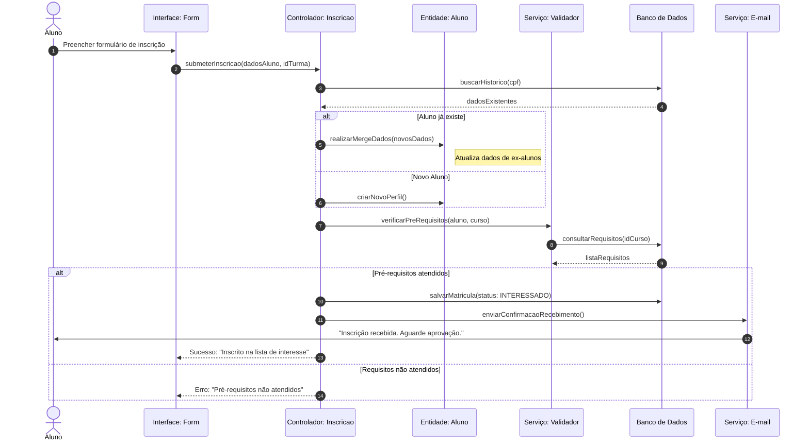

```mermaid
sequenceDiagram
    autonumber
    
    actor Aluno
    participant UI as Interface: Form
    participant Ctrl as Controlador: Inscricao
    participant EntAluno as Entidade: Aluno
    participant Val as Serviço: Validador
    participant DB as Banco de Dados
    participant Email as Serviço: E-mail

    Aluno->>UI: Preencher formulário de inscrição
    UI->>Ctrl: submeterInscricao(dadosAluno, idTurma)

    Ctrl->>DB: buscarHistorico(cpf)
    DB-->>Ctrl: dadosExistentes

    alt Aluno já existe
        Ctrl->>EntAluno: realizarMergeDados(novosDados)
        Note right of EntAluno: Atualiza dados de ex-alunos
    else Novo Aluno
        Ctrl->>EntAluno: criarNovoPerfil()
    end

    Ctrl->>Val: verificarPreRequisitos(aluno, curso)
    Val->>DB: consultarRequisitos(idCurso)
    DB-->>Val: listaRequisitos

    alt Pré-requisitos atendidos
        Ctrl->>DB: salvarMatricula(status: INTERESSADO)
        Ctrl->>Email: enviarConfirmacaoRecebimento()
        Email->>Aluno: "Inscrição recebida. Aguarde aprovação."
        Ctrl-->>UI: Sucesso: "Inscrito na lista de interesse"
    else Requisitos não atendidos
        Ctrl-->>UI: Erro: "Pré-requisitos não atendidos"
    end
```
